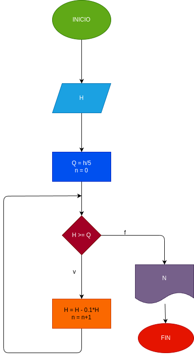

# While_2
 una pelota se deja caer de una altura h, y en cada rebote sube e 10% menos de la anterior. hacer el diagrama de flujo y el programa en python, que lea H, y que calcule e imprima en cual rebote la pelota no alcanza a subir la 5ta parte de la altura inicial.

 ## Input

 Ingrese la altura : "h"

 ## Proccesing

 Mientras que H caiga cada rebote tendra un 10% menos de altura que el roebota anterior

 - H = X
 - Q = H/5
 - N =  0

--------------------------
 
H = h - 0.1 * H
N= N + 1

## Output

Se imprime el resultado de N

## Diseño

